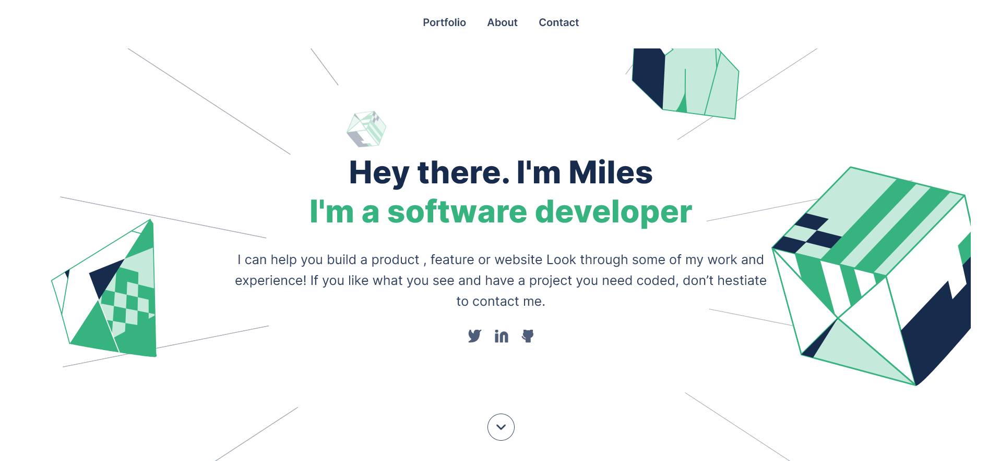

<a name="readme-top"></a>

<div align="center">

  <h1><b>My-Portfolio</b></h1>

  <br/><br/>

</div>

# 📗 Table of Contents

- [📖 About the Project](#about-project)
  - [🛠 Built With](#built-with)
    - [Tech Stack](#tech-stack)
    - [Key Features](#key-features)
  - [🚀 Live Demo](#live-demo)
- [💻 Getting Started](#getting-started)
  - [Setup](#setup)
  - [Prerequisites](#prerequisites)
  - [Usage](#usage)
  - [Deployment](#triangular_flag_on_post-deployment)
- [👥 Authors](#authors)
- [🔭 Future Features](#future-features)
- [🤝 Contributing](#contributing)
- [⭐️ Show your support](#support)
- [🙏 Acknowledgements](#acknowledgements)
<!-- - [❓ FAQ](#faq) -->
- [📝 License](#license)

<br/>

# 📖 My Portfolio <a name="about-project"></a>

**My Portfolio** is a port folio webpage which showcases some of my work and also demonstrate my skills and capabilities as fullstack developer.

Whatch [this video](https://www.loom.com/share/d3922c70b2b744d59e6b68b58ea0d1dd) to learn more.

## 🛠 Built With <a name="built-with"></a>

### Tech Stack <a name="tech-stack"></a>

<summary>Client</summary>
<ul>
  <li><a href="https://www.javascript.com/">JavaScript</a></li>
  <li><a href="https://www.w3schools.com/css/">CSS3</a></li>
  <li><a href="https://html.com/html5/">HTML5</a></li>
</ul>

<!-- <details>
  <summary>Server</summary>
  <ul>
    <li><a href="https://expressjs.com/">Express.js</a></li>
  </ul>
</details>

<details>
<summary>Database</summary>
  <ul>
    <li><a href="https://www.postgresql.org/">PostgreSQL</a></li>
  </ul>
</details> -->

### Key Features <a name="key-features"></a>

- **User Experience**
  - JavaScript adds a lot of functionality as well as providing some great user experiece to the user by making the page interactive.
- **Form validation**
  - The form on the page was validated using the built-in HTML5 form validation as well as personalised JavaScript form validation.
- **Page layout**
  - The page layout was implemented with both CSS gird and flexbox.

<p align="right">(<a href="#readme-top">back to top</a>)</p>

## 🚀 Live Demo <a name="live-demo"></a>

- Visit the live demo [here](https://timbar09.github.io/My-Portfolio/)

<p align="right">(<a href="#readme-top">back to top</a>)</p>

## 💻 Getting Started <a name="getting-started"></a>

To get a local copy up and running, follow these steps.

### Prerequisites

In order to run this project you need:

- [NodeJS and npm](https://nodejs.org/en/)
- An IDE (e.g. [Vususal Studio Code](https://code.visualstudio.com/download))
- A browser (e.g. Firefox)

<!--
Example command:

```sh
 gem install rails
```
 -->

### Setup

To clone this repository to your desired folder, follow the steps below:

**Using the command line**

- Use the following commands

```sh
  cd my-folder
  git clone https://github.com/Timbar09/My-Portfolio.git
```

**Using GitHub Desktop app**

- Follow the steps below

  - Visit this link "https://github.com/Timbar09/My-Portfolio.git"
  - Click the green button labelled "code"
  - Select the "Open with GitHub Desktop" option
  - After the GitHub Desktop add opens, click the "clone repo" button

### Usage

To run the project, execute the following command:

**Click the "Go Live" button on your IDE(VS Code in this case)**

### Deployment

You can deploy this project by:

- visiting your repository on [GitHub](https://github.com)
- Click on settings
- Go to the "Pages" option
- Select the main branch and save

<p align="right">(<a href="#readme-top">back to top</a>)</p>

## 👥 Authors <a name="authors"></a>
<br />

| 👤 Author | GitHub| Twitter | LinkedIn |
|:-------|:-------|:-------|:-------|
| Miles Mosweu | [@Timbar09](https://github.com/Timbar09) | [@Milez09](https://twitter.com/Milez09) | [@miles09](https://www.linkedin.com/in/miles09) |
| Dhiraj Singha | [@dhirajsingha143](https://github.com/dhirajsingha143) | [@DhirajS89134](https://twitter.com/DhirajS89134) | [@dhiraj-singha-b6871717a](https://www.linkedin.com/in/dhiraj-singha-b6871717a/) |
| Yared Tekle | [@yaredtekle022](https://github.com/yaredtekle022) | - | - |
| Kazaneza | [@kazaneza](https://github.com/kazaneza) | - | - |

<p align="right">(<a href="#readme-top">back to top</a>)</p>

## 🔭 Future Features <a name="future-features"></a>

- **Populate the portfolio project with more of my projects**

<p align="right">(<a href="#readme-top">back to top</a>)</p>

## 🤝 Contributing <a name="contributing"></a>

Contributions, issues, and feature requests are welcome!

Feel free to check the [issues page](https://github.com/Timbar09/My-Portfolio/issues).

<p align="right">(<a href="#readme-top">back to top</a>)</p>

## ⭐️ Show your support <a name="support"></a>

If you like this project, ⭐️ the project and let me know what you like in particular. 

<p align="right">(<a href="#readme-top">back to top</a>)</p>

## 🙏 Acknowledgments <a name="acknowledgements"></a>

I would like to thank [everyone](#readme-top) who collaborated with me on this project.

I would like to thank all my Microverse teams and the whole Microverse community for their help and contributions towards this project.

I would also like [Figma]() for the template and [Freepik]() for the project cards background images and mock-ups.

<p align="right">(<a href="#readme-top">back to top</a>)</p>

<!-- ## ❓ FAQ <a name="faq"></a>

- **How long did it to finish this project?**

  - I'll let you know when I am done building the project.

- **Can I contribute to the project?**

  - Knock yourself out.

<p align="right">(<a href="#readme-top">back to top</a>)</p> -->

## 📝 License <a name="license"></a>

This project is [MIT](./LICENSE) licensed.

<p align="right">(<a href="#readme-top">back to top</a>)</p>
