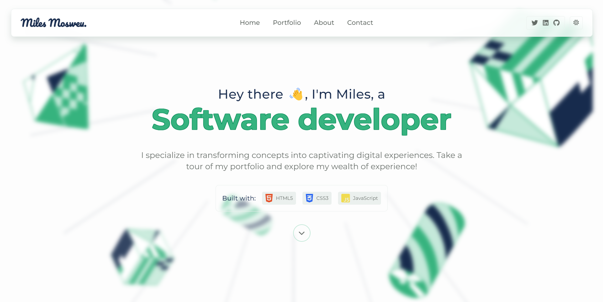

<a name="readme-top"></a>

  <h1><b>My Portfolio</b></h1>

<br/><br/>

## 📗 Table of Contents

- [📖 About the Project](#about-project)
  - [🛠 Built With](#built-with)
    - [Tech Stack](#tech-stack)
    - [Key Features](#key-features)
  - [🚀 Live Demo](#live-demo)
- [💻 Getting Started](#getting-started)
  - [Setup](#setup)
  - [Prerequisites](#prerequisites)
  - [Usage](#usage)
  - [Deployment](#triangular_flag_on_post-deployment)
- [👥 Authors](#authors)
- [🔭 Future Features](#future-features)
- [🤝 Contributing](#contributing)
- [⭐️ Show your support](#support)
- [🙏 Acknowledgements](#acknowledgements)
- [📝 License](#license)

<br/>

# 📖 <a name="about-project"></a>

> This is my portfolio site which showcases some of my work and also demonstrate my skills and capabilities as fullstack developer.

Whatch [this video](https://www.loom.com/share/d3922c70b2b744d59e6b68b58ea0d1dd) to learn more.

## 🛠 Built With <a name="built-with"></a>

### Tech Stack <a name="tech-stack"></a>

<summary>Client</summary>
<ul>
  <li><a href="https://www.javascript.com/">JavaScript</a></li>
  <li><a href="https://www.w3schools.com/css/">CSS3</a></li>
  <li><a href="https://html.com/html5/">HTML5</a></li>
</ul>

### Key Features <a name="key-features"></a>

- **Project Showcase**
  > Display of a selection of my best projects with descriptions, screenshots, and links to live demos or GitHub repositories.
- **Skills and Technologies**
  > Highlights the programming languages, frameworks, and technologies I am proficient in to showcase my technical expertise.
- **About Me Section**
  > Introduces myself, shares my background, and explains what drives me as a developer.
- **Contact Information**
  > Provides a way for visitors to easily get in touch me, such as a contact form and links to my professional social media profiles.
- **Responsive Design**
  > The site is mobile-friendly and looks good on various devices and screen sizes.
- **Interactive Elements**
  > Incorporates interactive features like animations, hover effects, or clickable elements that engage visitors and showcase my creativity.

<p align="right">(<a href="#readme-top">back to top</a>)</p>

## 🚀 Live Demo <a name="live-demo"></a>

- Visit [live site](https://milesmosweudev.netlify.app/)

<p align="right">(<a href="#readme-top">back to top</a>)</p>

## 💻 Getting Started <a name="getting-started"></a>

To get a local copy up and running, follow these steps.

### Prerequisites

In order to run this project you need:

- An IDE (e.g. [Vususal Studio Code](https://code.visualstudio.com/download))
- A browser (e.g. Firefox)

### Setup

To clone this repository to your desired folder, follow the steps below:

```sh
  cd my-folder
  git clone https://github.com/Timbar09/My-Portfolio.git
```

### Usage

To run the project, execute the following command:

> **Open the [index.html](./index.html) file using your browser or use the "[Live Server](https://marketplace.visualstudio.com/items?itemName=ritwickdey.LiveServer)" VS code extension.**

### Deployment

You can deploy this project by:

- visiting your repository on [GitHub](https://github.com)
- Click on settings
- Go to the "Pages" option
- Select the main branch and save

<p align="right">(<a href="#readme-top">back to top</a>)</p>

## 👥 Authors <a name="authors"></a>

<br />

| 👤 Author     | GitHub                                                 | Twitter                                           | LinkedIn                                                                         |
| :------------ | :----------------------------------------------------- | :------------------------------------------------ | :------------------------------------------------------------------------------- |
| Miles Mosweu  | [@Timbar09](https://github.com/Timbar09)               | [@Milez09](https://twitter.com/Milez09)           | [@miles09](https://www.linkedin.com/in/miles09)                                  |
| Dhiraj Singha | [@dhirajsingha143](https://github.com/dhirajsingha143) | [@DhirajS89134](https://twitter.com/DhirajS89134) | [@dhiraj-singha-b6871717a](https://www.linkedin.com/in/dhiraj-singha-b6871717a/) |
| Yared Tekle   | [@yaredtekle022](https://github.com/yaredtekle022)     | -                                                 | -                                                                                |
| Kazaneza      | [@kazaneza](https://github.com/kazaneza)               | -                                                 | -                                                                                |

<p align="right">(<a href="#readme-top">back to top</a>)</p>

## 🔭 Future Features <a name="future-features"></a>

- **Add a scroll progress bar**
- **Add more interesting keyframes**

<p align="right">(<a href="#readme-top">back to top</a>)</p>

## 🤝 Contributing <a name="contributing"></a>

Contributions, issues, and feature requests are welcome!

Feel free to check the [issues page](https://github.com/Timbar09/My-Portfolio/issues).

<p align="right">(<a href="#readme-top">back to top</a>)</p>

## ⭐️ Show your support <a name="support"></a>

If you like this project, ⭐️ the project and let me know what you like in particular.

<p align="right">(<a href="#readme-top">back to top</a>)</p>

## 🙏 Acknowledgments <a name="acknowledgements"></a>

I would like to thank [everyone](#authors) who collaborated with me on this project.

I would like to thank all my Microverse teams and the whole Microverse community for their help and contributions towards this project.

<p align="right">(<a href="#readme-top">back to top</a>)</p>

## 📝 License <a name="license"></a>

This project is [MIT](./LICENSE) licensed.

<p align="right">(<a href="#readme-top">back to top</a>)</p>
